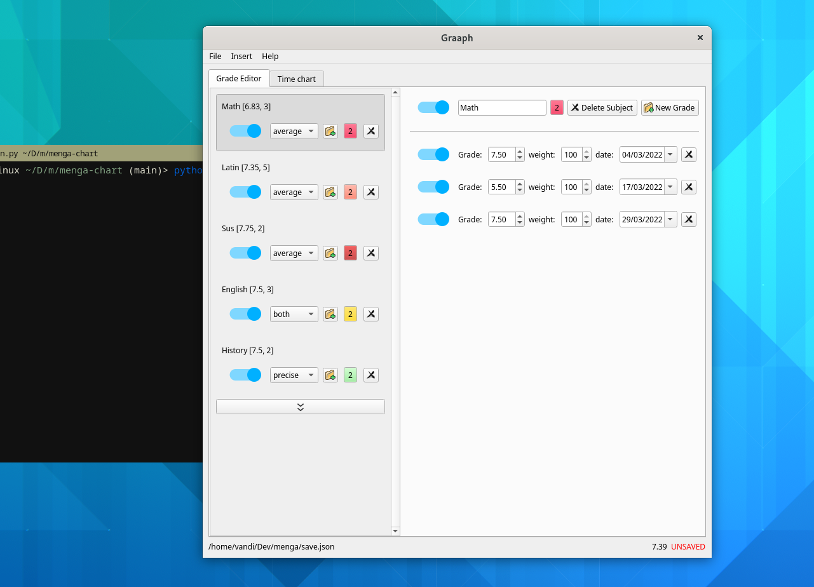
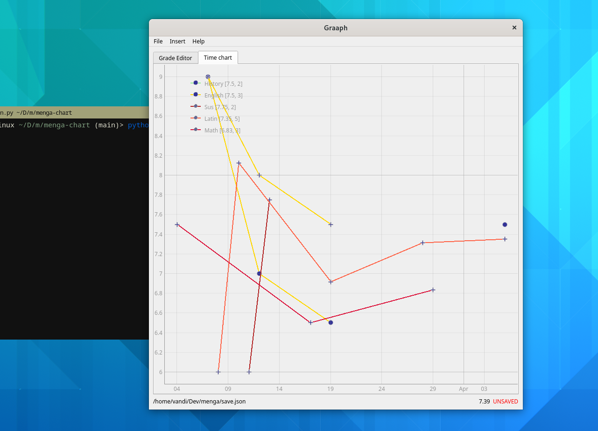

# Menga-chart
Soo, u are surely wondering what menga-chart is all about.  Well, it all started on a rainy sunday afternoon in the cold south-tirolian december...
I was surfing n the internet when i saw a very based chart of some strangers grades of their university exams. It showed all individual grade statistics plus the subject average.
The idea was somehow brilliant. How could such a simple chart with such simple data be so informative. I wanted to try it out wiht my own grades and a few coffee cups later, i had a script that scraped my grades from my schools webapp and slapped them on a chart. Very nice. Now what if this script was actually a deskto application that one can just download and run? what if you could edit the grades in real time? Well now its april and a very primitive form of the application is here. Its full of bugs, has the essential features i wanted it to have and is kind of easly installable? Good enough. I will be updating it in beetween other projects whenever i feel the need to. Just don't expect to much from me. Enjoy.

## Features:
- very fancy
- grade editor (also very fancy)
- line chart (a bit less fancy)
- thats it for now
- more stuff to come don't worry
- right, it also supports [https://www.digitalesregister.it/](https://www.digitalesregister.it/) importing and exporting

## Installation
Ok so basically, we dont have a standalone binary yet. I found out a few days ago the only way to ful compile a PyQt application to a true standalone binary is [PyQt-deploy](https://pypi.org/project/pyqtdeploy/). Pyinstaller and co usually just package the python files into a executabl but are still relient on python etc. The only issue is its pretty time and resource intesive. It may take an entire day on my puny little laptop. Other menga-team members do have nasa-hardware, but it still takes some time to make a release for all three operating systems, and i dont eel like distributing a application that is still in the alpha release and full of bugs. For now we offer a very rudementary solution in form of python wheel packages wich can be found in the release section. 

## Use instructions (read carefully):
da GUI is pretty self explainatory tbh

## Screenshots

## "tHe GuI iS uGly, PlEaSe AdD dArK mOdE":
 - for virgin windows users: https://github.com/ihonen/qt-creator-themes
 - for virgin mac os users: https://github.com/ihonen/qt-creator-themes
 - for virgin linux users: https://github.com/ihonen/qt-creator-themes
 - for chads: https://www.youtube.com/watch?v=dQw4w9WgXcQ

(kostenloser insult)
